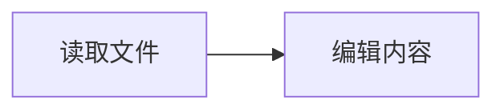

# 保持现有界面

这是第一段，可以直接编辑 **粗体** 和 *斜体*。

这是第二段，用于验证外部修改。

- 第一项
- 第二项

> 引用内容。


```mermaid
graph LR
A[读取文件] --> B[编辑内容]
```

```js
const answer = 42;
```

[需求文档](./markdown-workspace-wysiwyg-editing.md)

| 项目 | 内容 |
| --- | --- |
| 保存 | 自动 |
